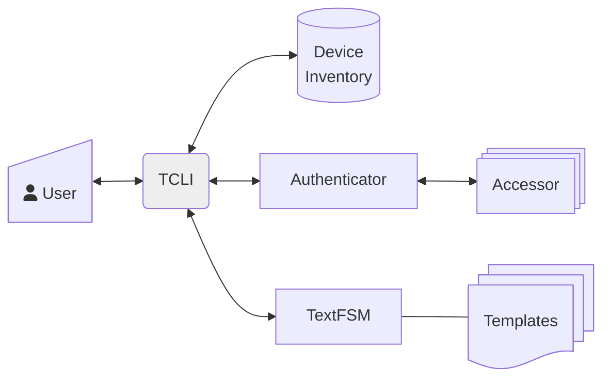

# TCLI – TextFSM Device CLI

> Forked from https://github.com/google/tcli - as that repo is now read-only.
> 
> TCLI was a starter project at Google back in 2008. Although a powerful tool for network
> troubleshooting, and popular within Google for over a decade, it is accidental code lacking in
> software design. The fork here may add little in the way of functionality, it does however slay a
> few of those dragons.

## Overview

TCLI is a client interface for issuing commands to arbitrarily large numbers of devices
(hundreds, thousands, even hundreds of thousands). It supports a rich set of interactive functions
and can collate responses into various tabular display formats.

An essential tool for scaling administration of networks when device access is required via CLI.
TCLI groups commands by device name or device attributes, sends and receives command outputs
asyncronously and tabulates them into a table for a unified view of the cross section of the device
fleet that you are interested in.

Useful for real time analysis, interactive or exploratory troubleshooting, and creating holistic views
of device state or configuration for the cross section of the fleet you are interested in.

Can be used against a live network, for real-time data, or against a repository of stored command
outputs for offline use with near-realtime data.

See the [TCLI Power Users Guide](https://github.com/harro/tcli/wiki/TCLI-Power-Users-Guide) for how 
to make use of the CLI functionality.

## Cautions and Caveats

Empowers users to run commands across potentially large sets of devices with very few restrictions
– please use wisely and cautiously.

Does not support commands that are multi-part, or have non-discrete responses 
e.g. the **ping** command.

> **Note**<br> You can use commands like `ping count 5 127.0.0.1` or
`monitor traffic brief count 2` that do not require <kbd>Ctrl</kbd>+<kbd>C</kbd> to terminate.

## Architecture

TCLI is the front end of the software stack and there are several additional 
components needed for a complete solution.



* [**TextFSM**](https://github.com/google/textfsm/wiki/Code-Lab) for formatting raw
CLI output into structured tables
* [**NTC Templates**](https://github.com/networktocode/ntc-templates) for TextFSM
to be able to structure output for specific commands and families of devices.
* **Accessor**: A service to send and receive commands to/from devices.
Examples include:
    * [Notch](https://pypi.org/project/notch.agent/)
    * [Rancid](https://pypi.org/project/rancidcmd/)
    * [Salt](https://docs.saltproject.io/en/latest/contents.html)
    * [Scrapli](https://carlmontanari.github.io/scrapli/)
    * [Netmiko](https://pypi.org/project/netmiko/)
* **Inventory**: A database, DNS or CVS file of device names and attributes, or the data file
from the accessor library above, such as router.db from RANCID.
* **Authenticator**: Most of the accessors systems above seem to skip this step ...
It's recommended practice to authenticate access and authorise what commands can be sent to a device.
For example a reasonable policy is to allow only NOC personnel call the CLI and to only allow
```show ...``` commands that do not make changes to device state.<BR>
This policy and its implementation will vary greatly between organisations and unfortunately
you'll need to 'roll your own' here.

## Getting Started

Although TCLI requires significant setup and basic Python familiarity. It can be run straight out
of the box with fictitious devices and a limited set of commands with canned output:

* Devices:
    * device_a
    * device_b
    * device_c
* Commands:
    * show version
    * show vlan

To try TCLI, execute the **main.py** script in the parent directory.

    python3 main.py

Once setup for your environment, the Power Users guide will get you up and running fast! - 
[TCLI Power Users Guide](https://github.com/harro/tcli/wiki/TCLI-Power-Users-Guide)

## Setup

To use in your environment TCLI needs to be configured to retrieve a list of devices from whatever system
is used to manage inventory. And integrated to call your device accessor system
(or to scrape the output files that it produces).

Your site customisations are made to a new file that implements a child class of ```Inventory```.
This class is declared in ```inventory.py```. so import, inherit, and override the
[methods](https://github.com/search?q=repo%3Aharro%2Ftcli+NotImplementedError&type=code)
```_FetchDevices``` and ```SendRequests``` of the parent ```Inventory``` class in your file.

A "canned" example is included
[```inventory_csv.py```](https://github.com/harro/tcli/blob/master/tcli/inventory_csv.py) for illustration.

Your substitute module is imported by ```tcli_lib.py``` and a single line for importing needs updating
[there](https://github.com/search?q=repo%3Aharro%2Ftcli+CHANGEME+tcli_lib.py&type=code)
to point at your new inventory module instead.

Contributors are welcome to add various ```inventory_<accessor>.py``` files for popular open source
device accessor methods.

The structured format for device output is enabled via [TextFSM](https://github.com/google/textfsm).
You can create new templates to display output in CSV or other structured
formats per the [TextFSM Code Lab](https://github.com/google/textfsm/wiki/Code-Lab).
Or use the open source template repository
[ntc-templates](https://github.com/networktocode/ntc-templates)
that provides a library of templates for many device types and common commands.

